---
## Front matter
lang: ru-RU
title: Установка и конфигурация операционной системы на виртуальную машину
author: |
	 Соколова Анастасия Витальевна НФИбд-03-18\inst{1}

institute: |
	\inst{1}Российский Университет Дружбы Народов

## Formatting
mainfont: PT Serif
romanfont: PT Serif
sansfont: PT Sans
monofont: PT Mono
toc: false
slide_level: 2
theme: metropolis
header-includes: 
 - \metroset{progressbar=frametitle,sectionpage=progressbar,numbering=fraction}
 - '\makeatletter'
 - '\beamer@ignorenonframefalse'
 - '\makeatother'
aspectratio: 43
section-titles: true

---

# Цели и задачи работы

## Цель лабораторной работы

Приобретение практических навыков установки операционной системы на виртуальную машину, настройки минимально необходимых для
дальнейшей работы сервисов.

## Задание к лабораторной работе

- установка на виртуальную машину VirtualBox ОС Linux, дистрибутив Centos

# Процесс выполнения лабораторной работы

## Создала новую виртуальную машину.

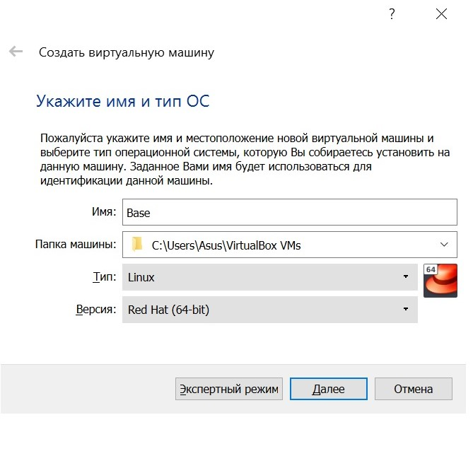{ #fig:001 width=30% }

## Указала размер основной памяти.

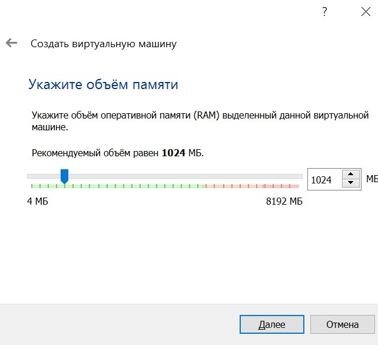{ #fig:002 width=30% }

## Задала конфигурацию жесткого диска.

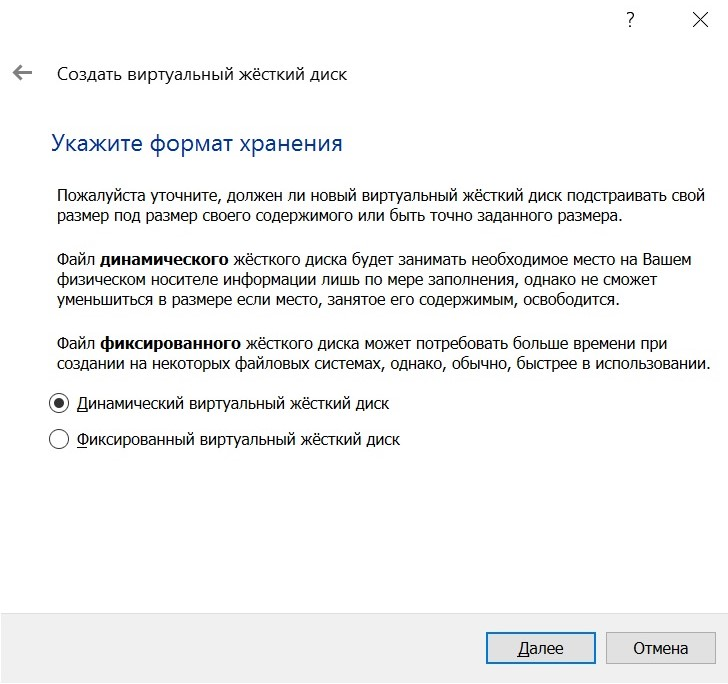{ #fig:003 width=30% }

## Задала размер диска.

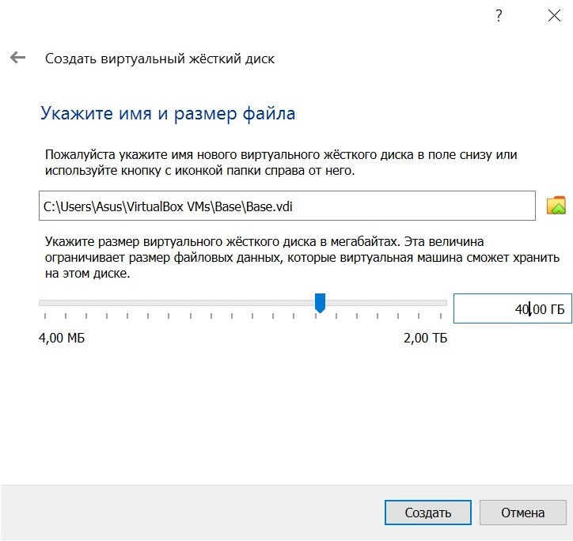{ #fig:004 width=30% }

## Добавила новый привод оптических дисков.

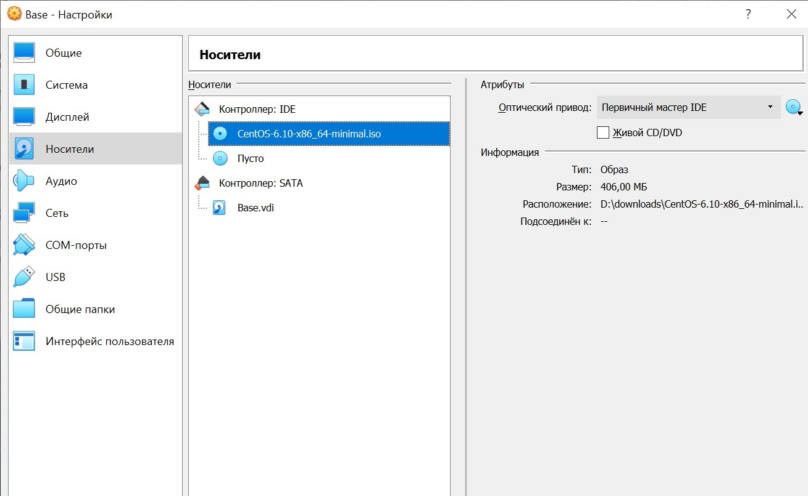{ #fig:005 width=30% }

## Запустила виртуальную машину Base.

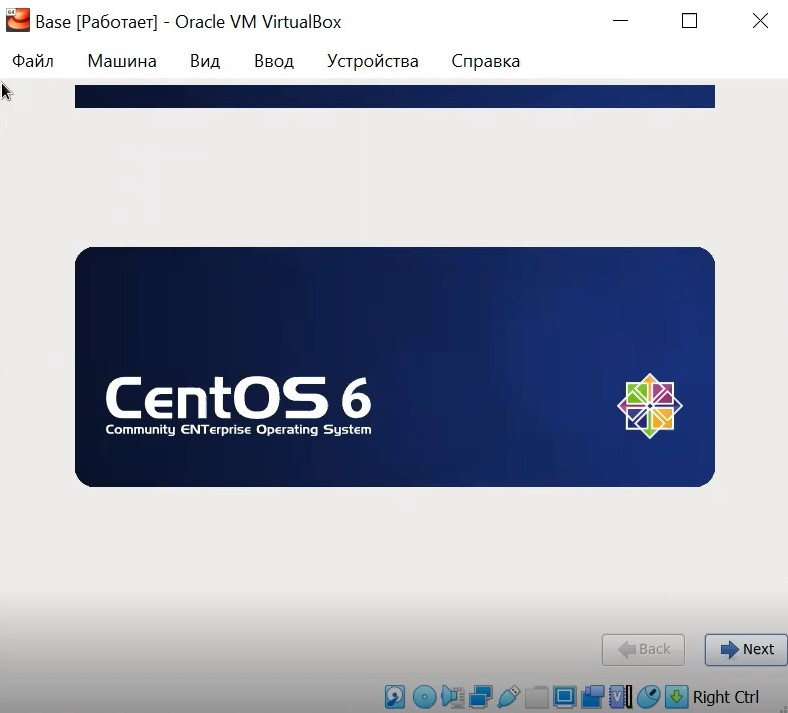{ #fig:006 width=30% }

## Установила русский язык для интерфейса

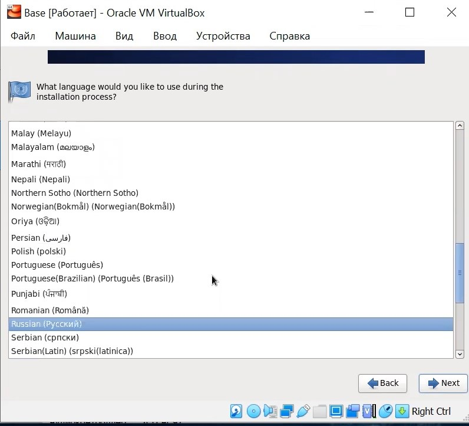{ #fig:007 width=30% }

## Указала "Стандартные накопители" для установки ОС 

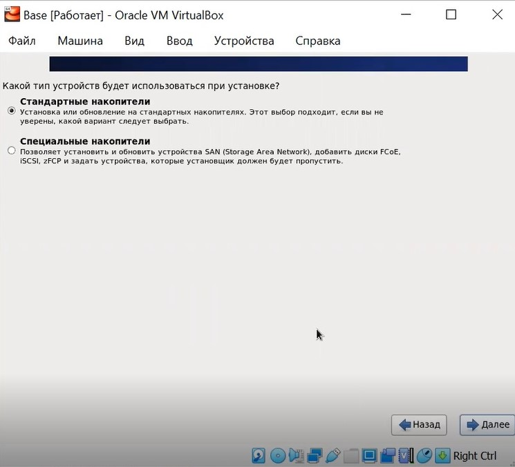{ #fig:008 width=30% }

## Установила сетевое имя

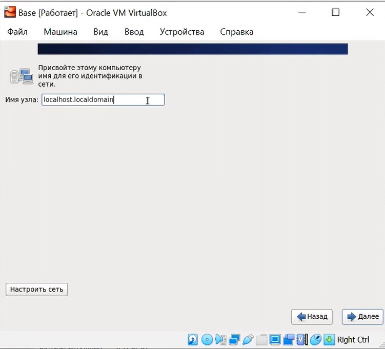{ #fig:009 width=30% }

## Указала часовой пояс

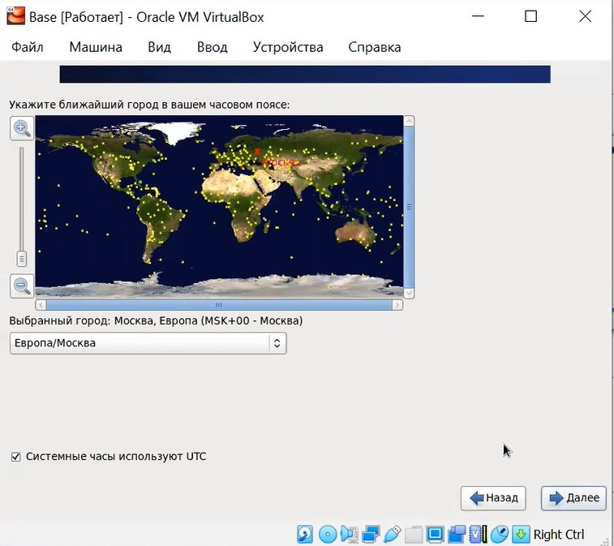{ #fig:010 width=30% }

## Установила пароль для root

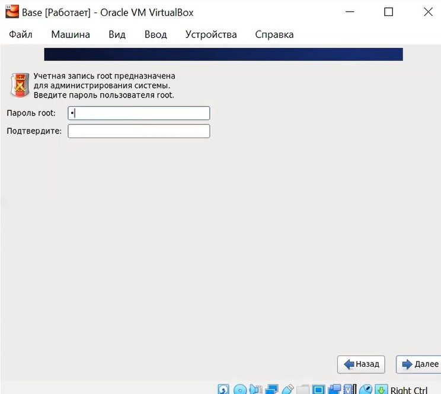{ #fig:011 width=30% }

## Указала тип установки

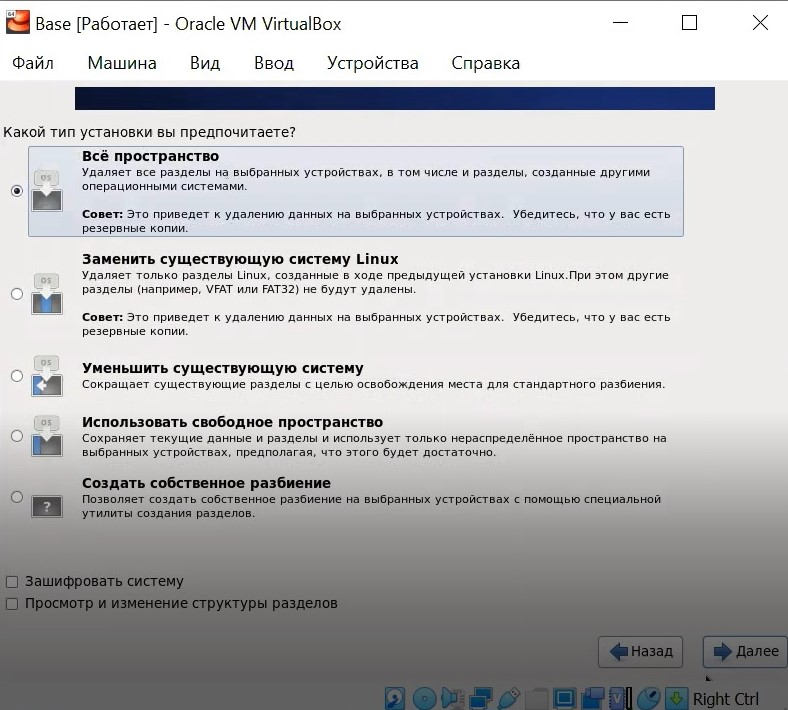{ #fig:012 width=30% }

## Завершила установку ОС и перезагрузила ее

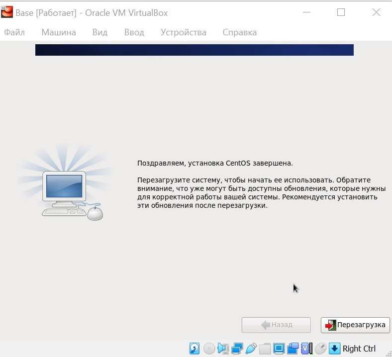{ #fig:014 width=30% }

## Зашла в созданную учетную запись

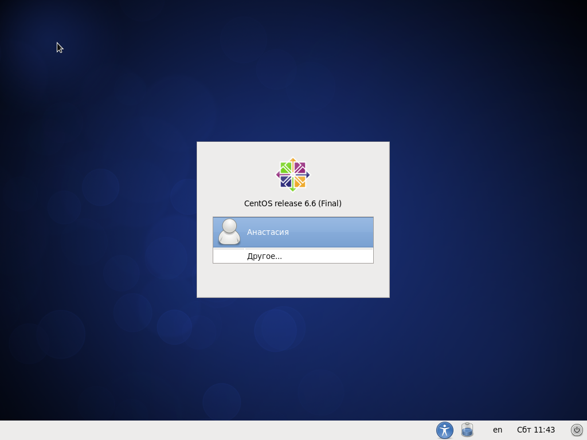{ #fig:015 width=30% }

## Запустила терминал и обновила системные файлы и установила необходимые программы

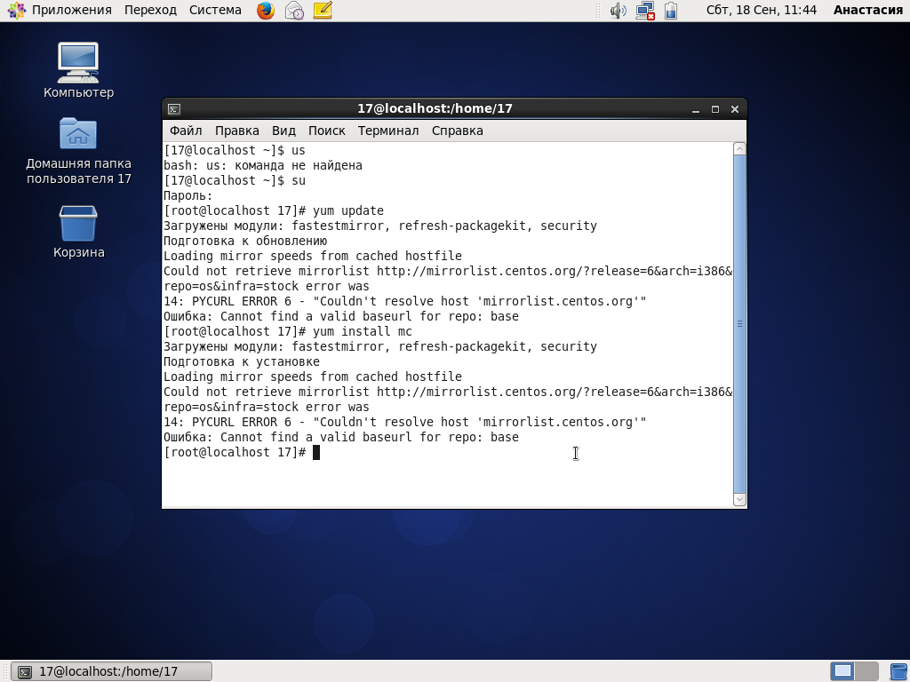{ #fig:016 width=30% }

# Выводы по проделанной работе

## Вывод

- установила ОС на виртуальную машину
- установила необходимые пакеты для дальнейшней работы