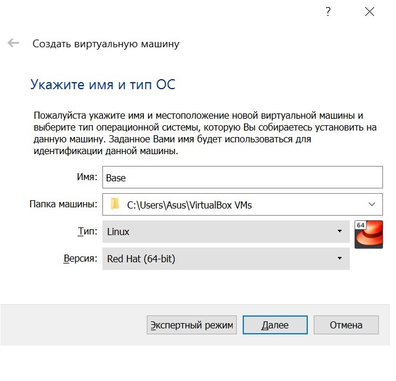
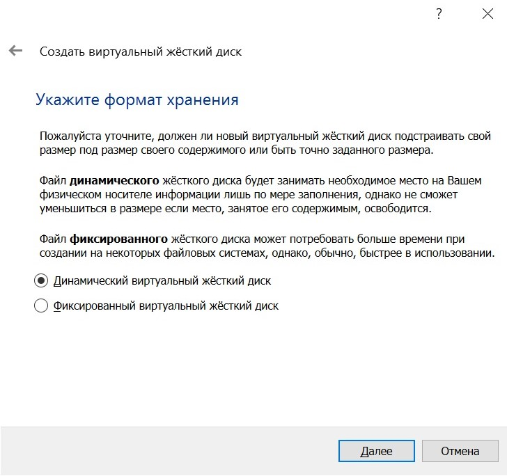
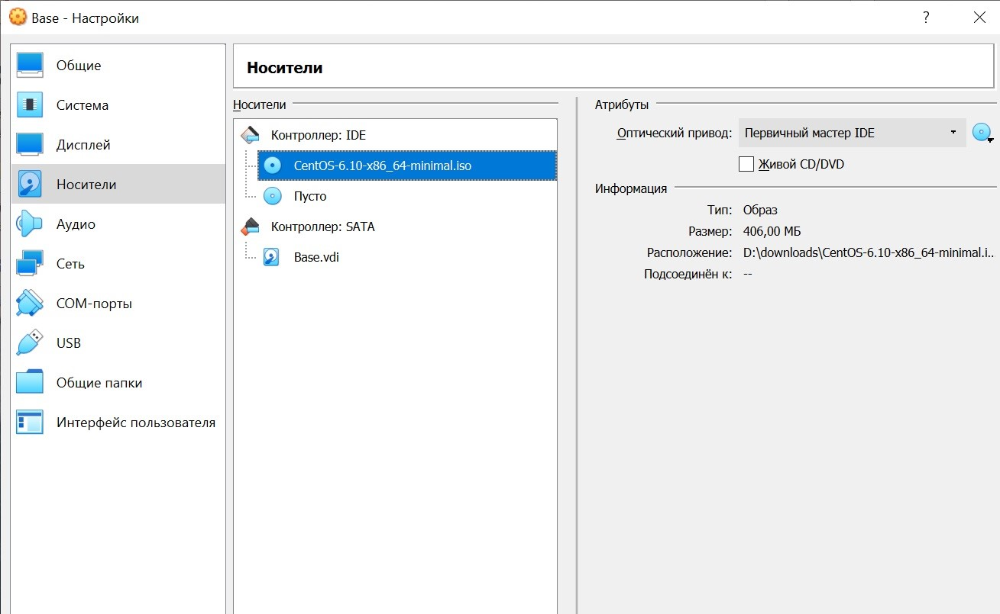
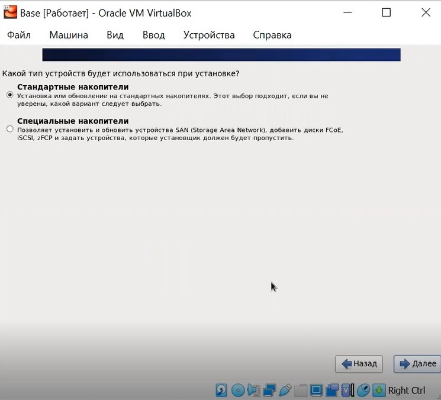
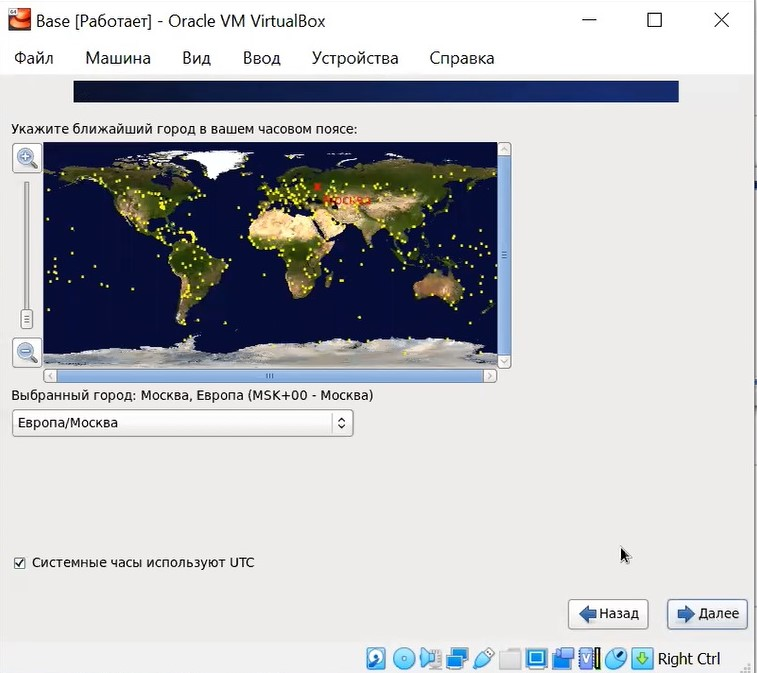
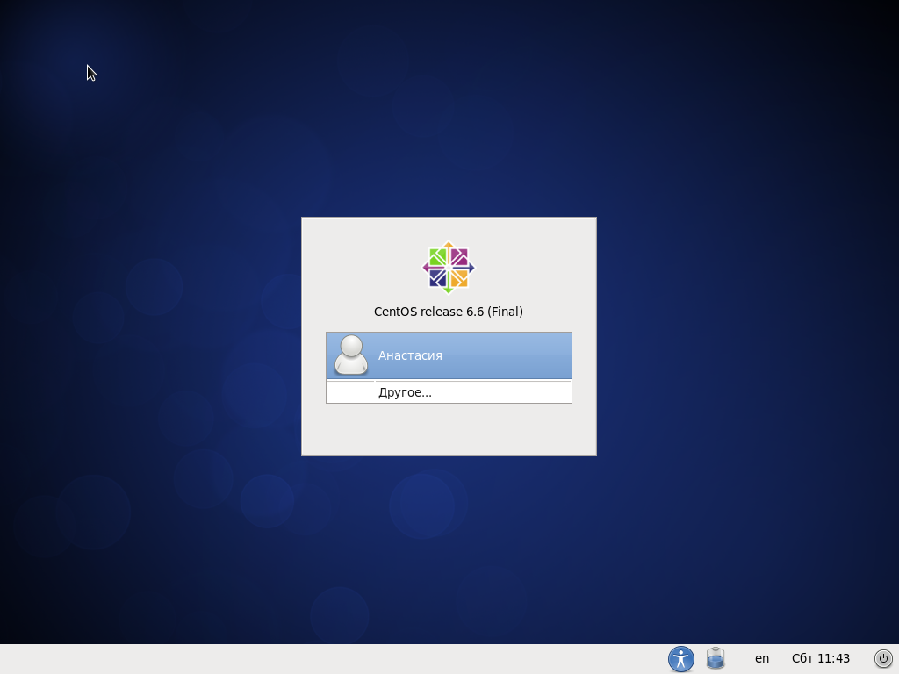

---
# Front matter
lang: ru-RU
title: "Отчет по лабораторной работе №1"
subtitle: "Установка и конфигурация операционной системы на виртуальную машину"
author: "Соколова Анастасия Витальевна НФИбд-03-18"

# Formatting
toc-title: "Содержание"
toc: true # Table of contents
toc_depth: 2
lof: true # List of figures
fontsize: 12pt
linestretch: 1.5
papersize: a4paper
documentclass: scrreprt
polyglossia-lang: russian
polyglossia-otherlangs: english
mainfont: PT Serif
romanfont: PT Serif
sansfont: PT Sans
monofont: PT Mono
mainfontoptions: Ligatures=TeX
romanfontoptions: Ligatures=TeX
sansfontoptions: Ligatures=TeX,Scale=MatchLowercase
monofontoptions: Scale=MatchLowercase
indent: true
pdf-engine: lualatex
header-includes:
  - \linepenalty=10 # the penalty added to the badness of each line within a paragraph (no associated penalty node) Increasing the υalue makes tex try to haυe fewer lines in the paragraph.
  - \interlinepenalty=0 # υalue of the penalty (node) added after each line of a paragraph.
  - \hyphenpenalty=50 # the penalty for line breaking at an automatically inserted hyphen
  - \exhyphenpenalty=50 # the penalty for line breaking at an explicit hyphen
  - \binoppenalty=700 # the penalty for breaking a line at a binary operator
  - \relpenalty=500 # the penalty for breaking a line at a relation
  - \clubpenalty=150 # extra penalty for breaking after first line of a paragraph
  - \widowpenalty=150 # extra penalty for breaking before last line of a paragraph
  - \displaywidowpenalty=50 # extra penalty for breaking before last line before a display math
  - \brokenpenalty=100 # extra penalty for page breaking after a hyphenated line
  - \predisplaypenalty=10000 # penalty for breaking before a display
  - \postdisplaypenalty=0 # penalty for breaking after a display
  - \floatingpenalty = 20000 # penalty for splitting an insertion (can only be split footnote in standard LaTeX)
  - \raggedbottom # or \flushbottom
  - \usepackage{float} # keep figures where there are in the text
  - \floatplacement{figure}{H} # keep figures where there are in the text
---

# Цель работы

Приобретение практических навыков установки операционной системы на виртуальную машину, настройки минимально необходимых для
дальнейшей работы сервисов.

# Задание

- установка на виртуальную машину VirtualBox ОС Linux, дистрибутив Centos

# Выполнение лабораторной работы

## Создала новую виртуальную машину под именем Base, тип ОС - Linux, RedHat. (рис. -@fig:001)

{ #fig:001 width=70% }

## Указала размер основной памяти - 1024 МБ. (рис. -@fig:002)

{ #fig:002 width=70% }

## Задала конфигурацию жесткого диска - загрузочный, VDI, динамический виртуальный диск.

{ #fig:003 width=70% }

## Задала размер диска - 40 ГБ. (рис. -@fig:004)

{ #fig:004 width=70% }

## В настройках Свойства - Носители добавила новый привод оптических дисков и выбрала образ CentOS, что заранее был скачан на компьютер. (рис. -@fig:005)

{ #fig:005 width=70% }

## Запустила виртуальную машину Base. (рис. -@fig:006)

{ #fig:006 width=70% }

- Установила русский язык для интерфейса (рис. -@fig:007)
- Указала "Стандартные накопители" для установки ОС (рис. -@fig:008)
- Установила сетевое имя (рис. -@fig:009)
- Указала часовой пояс (рис. -@fig:010)
- Установила пароль для root (рис. -@fig:011)
- Выбрала вариант стандартной установки ОС - Desktop
- Указала тип установки  (рис. -@fig:012)
- Завершила установку ОС и перезагрузила ее (рис. -@fig:013)

{ #fig:007 width=70% }

{ #fig:008 width=70% }

{ #fig:009 width=70% }

{ #fig:010 width=70% }

{ #fig:011 width=70% }

{ #fig:012 width=70% }

{ #fig:013 width=70% }

{ #fig:014 width=70% }

## Запустила виртуальную машину и настроила ее

## Зашла в созданную учетную запись. (рис. -@fig:015)

{ #fig:015 width=70% }

## Запустила терминал и обновила системные файлы и установила необходимые программы. (рис. -@fig:016)

{ #fig:016 width=70% }

# Выводы

- установила ОС на виртуальную машину
- установила необходимые пакеты для дальнейшней работы